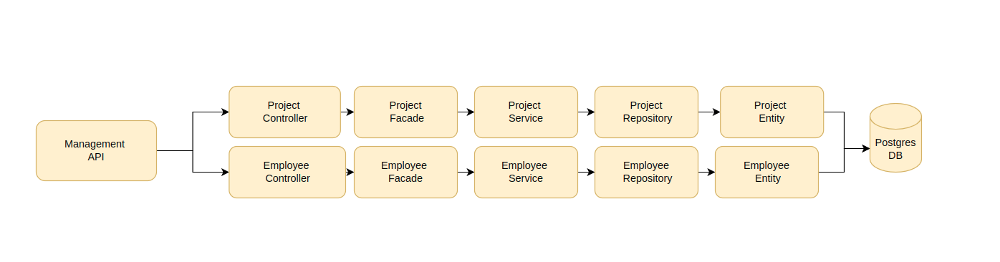

# Management API
Projeto desenvolvido para o processo seletivo da Orla. 

### Pré-requisitos
O que você precisa instalar para rodar o projeto?

* [Gradle](https://gradle.org/)
* [JDK-17](https://www.oracle.com/java/technologies/javase/jdk17-archive-downloads.html)
* [Postgres DB](https://www.postgresql.org/)
* [Docker](https://www.docker.com/)

### Como rodar a aplicação?
```
sh docker-compose-dev.sh
```

### Como rodar os teste?
```
./gradlew test
```

### Para acessar a documentação do Swagger:
```
http://localhost:8080/swagger-ui.html#/
```

### Para verificar se aplicação está rodando:
```
http://localhost:8080/healthcheck
```

## Tecnologias utilizadas

* [Gradle](https://gradle.org/) - De aplicativos móveis a microsserviços, de pequenas empresas a grandes empresas, a Gradle ajuda as equipes a construir, automatizar e fornecer software melhor, mais rapidamente.
* [Spring Boot Web Starter](https://mvnrepository.com/artifact/org.springframework.boot/spring-boot-starter-web) - Starter para construção de web, incluindo aplicativos RESTful, usando o Spring MVC. Usa o Tomcat como o contêiner incorporado padrão
* [Lombok](https://projectlombok.org/) - O Projeto Lombok é uma biblioteca java que se conecta automaticamente ao seu editor e cria ferramentas, apimentando seu java. Nunca escreva outro método getter ou equals novamente, com uma anotação sua classe tem um construtor com todos os recursos, Automatize suas variáveis ​​de registro e muito mais.
* [Spring Boot Test Starter](https://mvnrepository.com/artifact/org.springframework.boot/spring-boot-starter-test) - Starter para testar aplicativos Spring Boot com bibliotecas, incluindo JUnit, Hamcrest e Mockito.
* [Model Mapper](http://modelmapper.org/) - Os aplicativos geralmente consistem em modelos de objetos semelhantes, mas diferentes, em que os dados em dois modelos podem ser semelhantes, mas a estrutura e as preocupações dos modelos são diferentes. O mapeamento de objetos facilita a conversão de um modelo em outro, permitindo que modelos separados permaneçam segregados.
* [Swagger](https://swagger.io/) - Simplifique o desenvolvimento de API para usuários, equipes e empresas com o conjunto de ferramentas open source e profissional Swagger.
* [Power Mock](https://powermock.github.io/) - O PowerMock é uma estrutura que estende outras bibliotecas simuladas, como o EasyMock, com recursos mais poderosos. O PowerMock usa um carregador de classes personalizado e manipulação de bytecode para permitir a simulação de métodos estáticos, construtores, classes e métodos finais, métodos particulares, remoção de inicializadores estáticos e muito mais.
* [Flyway Migration](https://aws.amazon.com/pt/ses/) - O Flyway é uma ferramenta de migração de banco de dados de código aberto, projetada para facilitar o gerenciamento e a evolução do esquema do banco de dados ao longo do tempo. Ele é frequentemente usado em projetos que usam sistemas de gerenciamento de banco de dados relacionais, como PostgreSQL, MySQL, Oracle, SQL Server, entre outros.
* [Bean Validation](https://aws.amazon.com/pt/ses/) - O Bean Validation é uma especificação do Java que fornece um conjunto de anotações e APIs para validar dados em objetos Java, especialmente em objetos que representam entidades, DTOs (Objetos de Transferência de Dados) e outros componentes dentro de uma aplicação.

## Architecture
